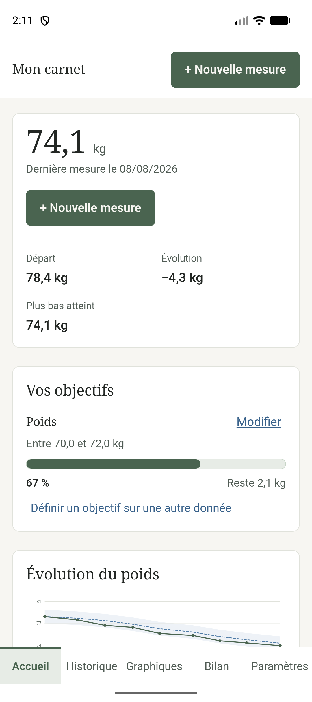
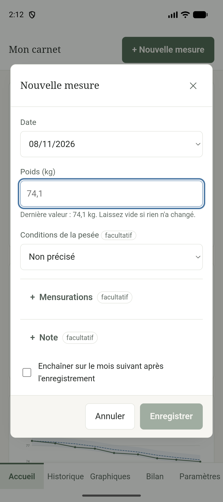
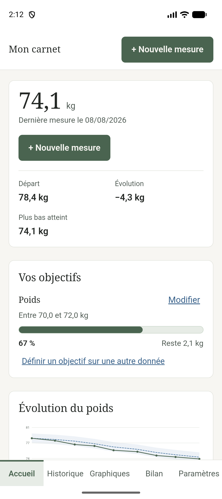
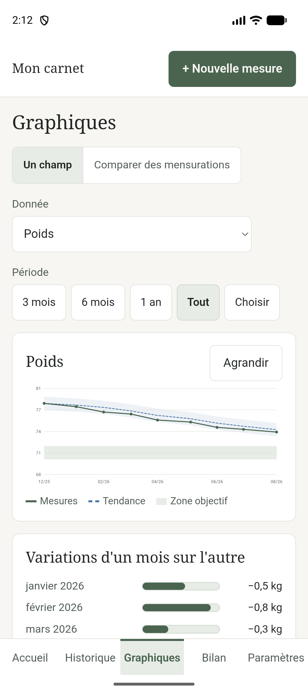
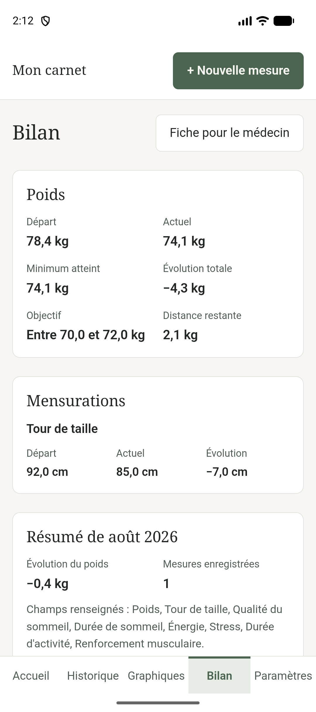
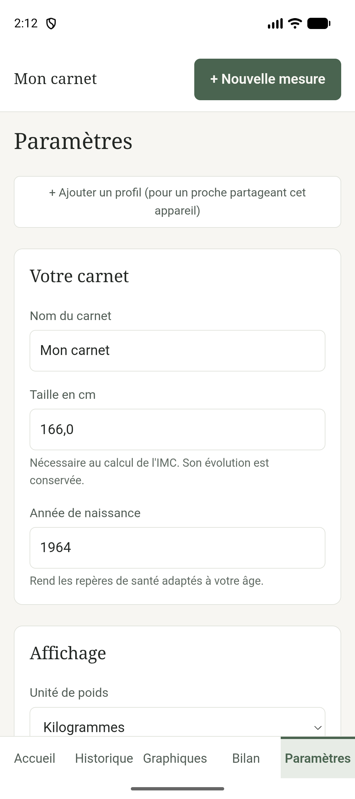

# Carnet Bien-être — guide d'utilisation

Ce guide se lit dans l'ordre ou se picore. Il n'y a rien à apprendre par cœur :
l'application est faite pour qu'on puisse s'en servir sans guide.

---

## En deux phrases

Vous notez ce que vous voulez, quand vous voulez. L'application vous le remontre
plus tard, sans jamais vous juger.

---

## Ce que vous voyez en ouvrant

L'accueil répond à une question : *où en suis-je ?*

- La **grande valeur** en haut est votre dernière mesure.
- **Départ**, **Évolution** et **Plus bas atteint** situent le chemin parcouru.
- **Vos objectifs** montre où vous en êtes de ce que vous vous êtes fixé — s'il y
  en a. Le carnet fonctionne très bien sans.
- La **courbe** dessine votre évolution. Le trait pointillé est une tendance
  lissée ; la bande claire autour représente les variations normales d'un jour à
  l'autre, celles qui ne veulent rien dire.

En bas, cinq onglets. C'est toute la navigation.

---

## Noter une mesure

Le bouton **+ Nouvelle mesure** est toujours à portée, en haut et sur l'accueil.

**Une date et une seule valeur suffisent.** Tout le reste est facultatif et
replié : mensurations, bien-être, activité, note. Vous dépliez ce dont vous avez
besoin, et vous laissez le reste fermé.

Quelques détails utiles :

- **La dernière valeur est rappelée en gris** sous chaque champ. C'est un repère,
  pas une donnée : tant que vous n'y touchez pas, rien n'est enregistré.
- **La virgule et le point** fonctionnent aussi bien l'un que l'autre.
- Si vous tapez une valeur très éloignée de la précédente, l'application vous
  demande confirmation. Elle ne refuse jamais : c'est vous qui savez.
- **Enchaîner sur le mois suivant** sert à rattraper plusieurs mois d'un coup :
  après l'enregistrement, le formulaire se rouvre un mois plus loin.

### Si vous vous êtes trompée

Rien n'est définitif. Dans l'**Historique**, chaque ligne s'ouvre en modification.
Une suppression demande confirmation et reste annulable pendant quelques
secondes.

---

## Relire ce que vous avez noté

L'**Historique** liste toutes vos mesures, de la plus récente à la plus ancienne,
avec uniquement les valeurs que vous avez renseignées.

Les **Graphiques** montrent une donnée à la fois — vous choisissez laquelle. Vous
pouvez limiter la période aux trois derniers mois, à l'année, ou choisir vos
propres dates. Le bouton **Agrandir** met la courbe en plein écran, ce qui aide
beaucoup sur un téléphone.

Sous la courbe, un tableau reprend les mêmes valeurs en toutes lettres. Il est là
pour les lecteurs d'écran, et il dépanne quand la courbe est trop serrée.

Le **Bilan** résume le mois et l'ensemble du carnet, et se termine par une
question ouverte — à laquelle vous répondez si vous en avez envie. Deux lignes
écrites valent souvent mieux que douze cases cochées.

---

## Se fixer un objectif — ou pas

Le carnet marche très bien sans objectif. Si vous en voulez un, l'accueil propose
de le définir.

**Quatre formes**, et le choix compte plus qu'il n'en a l'air :

| Forme | Ce que ça veut dire |
|---|---|
| **Une fourchette** | « Entre 70 et 72 kg ». Recommandé : on n'échoue plus à 72,3. |
| **Me maintenir** | Rester dans une plage, sans direction. |
| **Une valeur précise** | Un chiffre unique à atteindre. |
| **Une régularité** | « Dormir 7 h, cinq nuits par semaine ». |

Un objectif peut porter sur **n'importe quelle donnée suivie** : le poids, un
tour de taille, des heures de sommeil, un niveau de stress. Vous pouvez en avoir
plusieurs à la fois, un par donnée.

> **Sur la régularité.** L'application compte les fois où vous remplissez la
> condition **parmi les jours que vous avez notés**, jamais sur les sept jours de
> la semaine. Un jour sans saisie n'est pas un jour manqué : il n'a simplement
> pas été observé.

---

## Régler l'application à votre main

Tout se règle ici, et rien n'y est définitif.

- **Écrans affichés** — « Essentiel » masque le Bilan pour alléger. « Complet »
  l'ajoute.
- **Taille du texte** — jusqu'à 200 %. La mise en page suit sans jamais déborder.
- **Thème** — clair, sombre, ou contraste élevé. Et une **teinte** au choix parmi
  cinq, indépendante du reste.
- **Données suivies** — la liste de tout ce que le carnet sait noter. Cochez ce
  qui vous intéresse, décochez le reste. **Y compris le poids** : quelqu'un qui ne
  veut suivre que son sommeil peut le faire.
  Décocher une donnée n'efface jamais ce que vous aviez noté.
- **Mode sans chiffre** — remplace les valeurs de poids par leur seule tendance,
  partout. Pour qui le chiffre met en difficulté.

---

## Vos données vous appartiennent

C'est le point le plus important, et le seul qui demande un geste de votre part.

**Tout est enregistré sur ce téléphone.** Il n'y a ni compte, ni inscription, et
rien ne part sans que vous le demandiez.

**La contrepartie : un téléphone perdu emporte le carnet avec lui.**
Dans **Paramètres → Vos données**, le bouton d'export produit un fichier qui
contient tout. Rangez-le quelque part — un courriel à vous-même suffit. C'est le
seul geste que l'application ne peut pas faire à votre place.

Trois formats, pour trois usages :

- **JSON** — la vraie sauvegarde. Elle se réimporte à l'identique.
- **CSV** ou **Excel** — pour ouvrir vos données dans un tableur.
- **Imprimer** — pour avoir une trace papier.

Il existe aussi une **fiche pour le médecin**, depuis le Bilan : une page conçue
pour être imprimée et emportée en consultation.

---

## Les fonctions facultatives

Trois choses n'existent que si vous les activez, et sont désactivées au départ.

**Rappel** — un message discret à l'ouverture si vous n'avez rien noté depuis un
moment. Jamais de notification qui sonne.

**Météo** — le carnet peut noter le temps qu'il fait avec chaque mesure. C'est la
seule fonction qui interroge un service extérieur : vous choisissez une commune,
et seules ses coordonnées approximatives sont transmises. Vous pouvez aussi
simplement écrire la météo à la main, sans rien activer.

**Synchronisation Nextcloud** — dépose votre carnet sur votre propre serveur, en
appuyant sur un bouton. Si deux appareils divergent, l'application vous montre
les deux versions et vous laisse choisir ; elle ne mélange jamais.

---

## Les mises à jour

Si vous utilisez la **version web** — celle que vous avez ajoutée à votre écran
d'accueil depuis le navigateur — l'application se tient à jour toute seule. Quand
une nouvelle version existe, un bandeau apparaît en haut :

> Une nouvelle version du carnet est prête. **[Mettre à jour]**

Rien ne se passe tant que vous n'appuyez pas. Vous pouvez finir ce que vous étiez
en train de noter et appuyer plus tard, ou même ignorer le bandeau : il
réapparaîtra. Vos données ne sont jamais touchées par une mise à jour.

Si vous utilisez l'**application Android**, les mises à jour de fonctionnement
passent aussi par là. Seules les rares évolutions qui touchent au téléphone
lui-même — la synchronisation Nextcloud, la lecture des pas — demandent
d'installer un nouveau fichier.

## Questions courantes

**J'ai sauté trois mois. C'est grave ?**
Non. Reprenez où vous voulez. L'application ne parle jamais de retard ni d'oubli,
et une période sans saisie reste une période sans saisie.

**Pourquoi mon poids monte alors que je fais attention ?**
Le poids varie d'un jour à l'autre pour des raisons qui n'ont rien à voir avec ce
que vous faites. C'est exactement pourquoi la courbe affiche une tendance lissée
et une bande de variation normale : un écart à l'intérieur de cette bande est
présenté comme une stabilité, parce que c'en est une.

**Est-ce que quelqu'un voit mes données ?**
Non. Il n'y a aucun compte, aucun serveur, aucun traceur, aucune mesure
d'audience.

**Puis-je partager le téléphone avec quelqu'un ?**
Oui. **Paramètres → Profils** permet d'avoir plusieurs carnets séparés sur le
même appareil.

**L'application peut-elle me dire si je suis en bonne santé ?**
Non, et elle ne le prétendra jamais. Les repères qu'elle affiche sont indicatifs.
Ce n'est pas un dispositif médical, il n'établit aucun diagnostic et ne remplace
aucun avis professionnel.

---

*Une question que ce guide ne couvre pas ? Les captures de ce document viennent
d'un carnet de démonstration ; les valeurs qu'on y voit sont inventées.*
